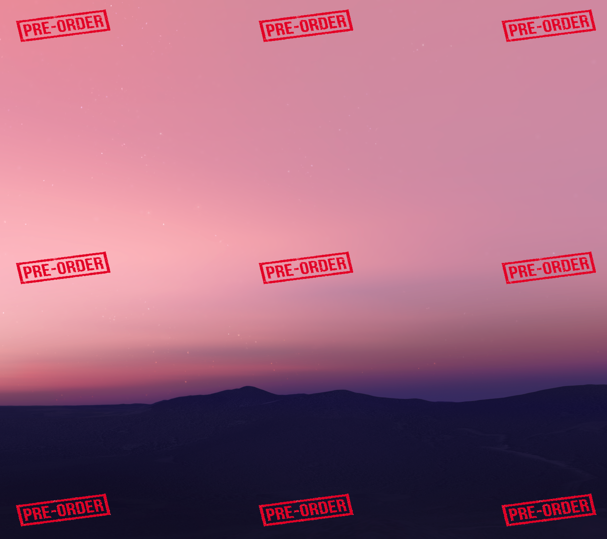

# overlay
PoC python, PIL based CLI to quickly overlay one image to a set of other images

### Installation

I didn't feel like putting this up on PyPi so you'll have to install from here. There are other ways to do this but I think this is the most robust way. 

 - If you haven't already, install [`pipx`](https://pypi.org/project/pipx/) system wide
```bash
pip install pipx
```
 - Clone the repo
```bash
git clone https://github.com/Mattwmaster58/overlay.git
```
 - Install with `pipx`
```bash
pipx install -e ./overlay
```
 - `-e` install in development mode, so anytime you may need to pull an upgrade from this repo, a simple git pull _should_ update the app
 - You may be prompted by `pipx` to add its paths to your PATH variable, you will need to do this to ensure `overlay` is available system wide.

### Usage

```
Usage: overlay [OPTIONS]

Options:
  -p, --position [top-left|top|top-right|right|bottom-right|bottom|bottom-left|left|center]
  -h, --relative-height FLOAT RANGE
                                  width as a decimal relative to the base
                                  image's width  [0.01<=x<=1]
  -w, --relative-width FLOAT RANGE
                                  width as a decimal relative to the base
                                  image's height  [0.01<=x<=1]
  -i, --input DIRECTORY           folder to scan for images to overlay. If
                                  unspecified, defaults to current working
                                  directory
  -o, --overlay FILE              specifies the image to overlay on the base
                                  images. If unspecified, the input folder
                                  will be scanned for a supported image format
                                  with the name "overlay"
  --in-place                      perform the overlay in place
  -v, --verbose                   enables debug logging
  --help                          Show this message and exit.
```

### Demo

All positions of overlay image demonstrated below


